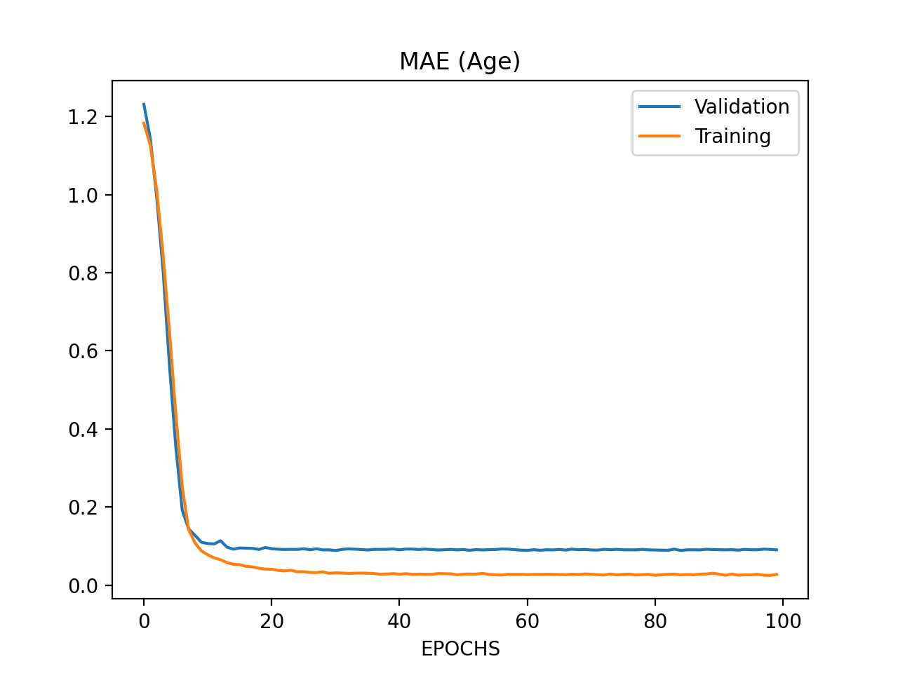
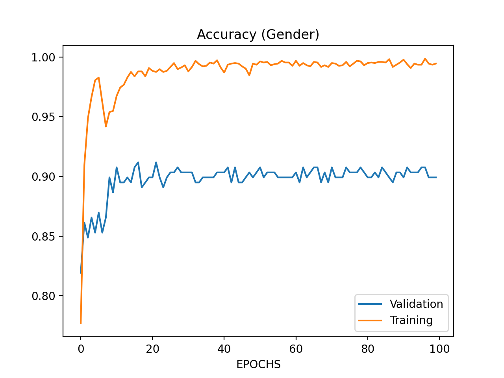

# AgePrediction

First pass model has been developed using `shufflenet_v2_x1_0` from pytorch.models. The model has been trained for 100 epochs. Data split is `90%` training and `10%` validation.

The model performance is:
| Parameter | Value |
| :---      | :---- | 
| Training Accuracy (Gender)     | 0.994      | 
| Validation Accuracy (Gender)   | 0.899      | 
| Training MAE Loss (Age)        | 0.028      | 
| Validation MAE Loss (Age)      | 0.091      | 

## Performance plots

model source: https://github.com/sajjjadayobi/FaceLib